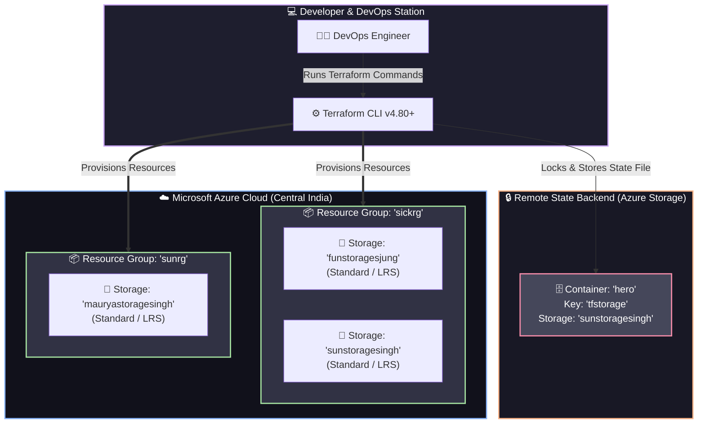

<div align="center">

# 🚗⚡ Cloud Automotive Landing Zone (Azure IaC) ☁️🌐

[](https://www.terraform.io/)
[](https://azure.microsoft.com/)
[](https://www.terraform.io/)
[](https://azure.microsoft.com/services/devops/)
[](#)

<br/>

> 🚀 **An Enterprise-Grade, Automated Azure Cloud Landing Zone built with Terraform for scalable, secure, and robust cloud infrastructure provisioning.**

---

[📖 Overview](#-overview) •
[✨ Key Features](#-key-features) •
[🏛️ Architecture](#️-architecture-workflow) •
[📂 Project Structure](#-project-structure) •
[🚀 Quick Start](#-quick-start-guide) •
[⚙️ Configuration](#️-configuration--variables) •
[🛡️ Best Practices](#️-best-practices--security)

---

</div>

<br/>

## 🌟 Overview

Welcome to the **Car Landing Zone** infrastructure repository! 🏎️💨  
This project delivers a **declarative, repeatable, and scalable cloud foundation** on Microsoft Azure using **HashiCorp Terraform**. It automates resource group provisioning, enterprise storage accounts, and remote state backend locking to establish a reliable baseline environment for mission-critical automotive workloads and cloud-native services.

---

## ✨ Key Features

| Icon | Feature | Description |
| :---: | :--- | :--- |
| ⚡ | **Automated Provisioning** | 100% Infrastructure as Code (IaC) with zero manual click-ops. |
| 🔄 | **Dynamic `for_each` Engine** | Scalable, map-driven deployments without duplicating code. |
| 🔒 | **Secure Remote Backend** | Centralized Terraform state stored securely in Azure Blob Storage. |
| 🧱 | **Modular Structure** | Decoupled configurations for easy scaling and custom environment setups. |
| 🌍 | **Multi-Resource Management** | Seamlessly connects multiple Resource Groups and Storage Accounts. |
| 🛡️ | **Enterprise Standards** | Ready for CI/CD integration, governance policies, and tagging. |

---

## 🏛️ Architecture Workflow



---

## 📂 Project Structure

```bash
car_landing_zone/
├── 📜 main.tf               # 🏗️ Core resource definitions (Resource Groups & Storage Accounts)
├── 📜 provider.tf           # 🔌 Provider & Azure remote backend configuration
├── 📜 variables.tf          # 📋 Input variable declarations (for_each dynamic maps)
├── 📜 terraform.tfvars      # 🎯 Environment-specific parameter values
├── 📄 .terraform.lock.hcl   # 🔒 Provider lock file for reproducible builds
├── 🙈 .gitignore            # 🚫 Ignores sensitive state files and caches
└── 📘 README.md             # 📖 High-impact project documentation
```

---

## 🛠️ Prerequisites

Before launching the landing zone, ensure you have the following tools installed:

- [x] 💠 **[Azure CLI](https://learn.microsoft.com/en-us/cli/azure/install-azure-cli)** (`>= 2.50.0`)
- [x] 🟣 **[Terraform](https://developer.hashicorp.com/terraform/downloads)** (`>= 1.5.0`)
- [x] 🔑 **Active Azure Subscription** with Contributor/Owner permissions

---

## 🚀 Quick Start Guide

Follow these simple steps to spin up your cloud infrastructure:

### 1️⃣ Clone & Navigate
```bash
git clone <your-repo-url>
cd car_landing_zone
```

### 2️⃣ Authenticate with Azure
```bash
az login
az account set --subscription "<YOUR_SUBSCRIPTION_ID_OR_NAME>"
```

### 3️⃣ Initialize Terraform
> *Initializes the Azure provider (`azurerm ~> 4.80.0`) and connects to the remote backend.*
```bash
terraform init
```

### 4️⃣ Preview Infrastructure Plan 🔍
> *Inspect exactly what Azure resources will be created before touching the cloud.*
```bash
terraform plan
```

### 5️⃣ Deploy to Cloud 🚀
> *Apply the configuration and watch your Landing Zone come to life!*
```bash
terraform apply -auto-approve
```

### 6️⃣ Tear Down Resources 🧹
> *To clean up and avoid unexpected cloud costs when testing:*
```bash
terraform destroy -auto-approve
```

---

## ⚙️ Configuration & Variables

Custom configurations can be tailored in [`terraform.tfvars`](file:///d:/devops%20_batch%2018/seeta_project/car_landing_zone/terraform.tfvars):

### 📋 Variables Reference

| Variable | Type | Purpose | Example Resource |
| :--- | :---: | :--- | :--- |
| `five` | `map` | Managed Resource Groups with governance ownership | `sickrg` (`managed_by = "arun"`) |
| `hero` | `map` | Primary Storage Accounts hosted under `sickrg` | `funstoragesjung`, `sunstoragesingh` |
| `mix` | `map` | Secondary Resource Groups | `sunrg` |
| `nice` | `map` | Storage Accounts dynamically linked to secondary RGs | `mauryastoragesingh` |

---

## 🛡️ Best Practices & Security

- 🔐 **Zero Secrets in Source Control**: Sensitive keys and state are excluded via `.gitignore`.
- 📦 **State Locking**: Remote backend on Azure Blob Storage prevents concurrent deployments.
- 🏷️ **Standardized Naming & Location**: All workloads are currently anchored to `centralindia` for optimal latency and compliance.
- ⚡ **High Availability**: Configured with `Standard_LRS` with instant upgrade paths to `GRS`/`ZRS`.

---

<div align="center">

### 💡 Pro Tip for DevOps Engineers
```bash
terraform fmt -recursive && terraform validate
```
*Always keep your code formatted and syntactically validated before committing!* 🚀

---

### 🌟 Show your support
Give a ⭐️ if this project helped you build your Azure Landing Zone!

**Crafted with ❤️ and DevOps Passion** ⚡

</div>